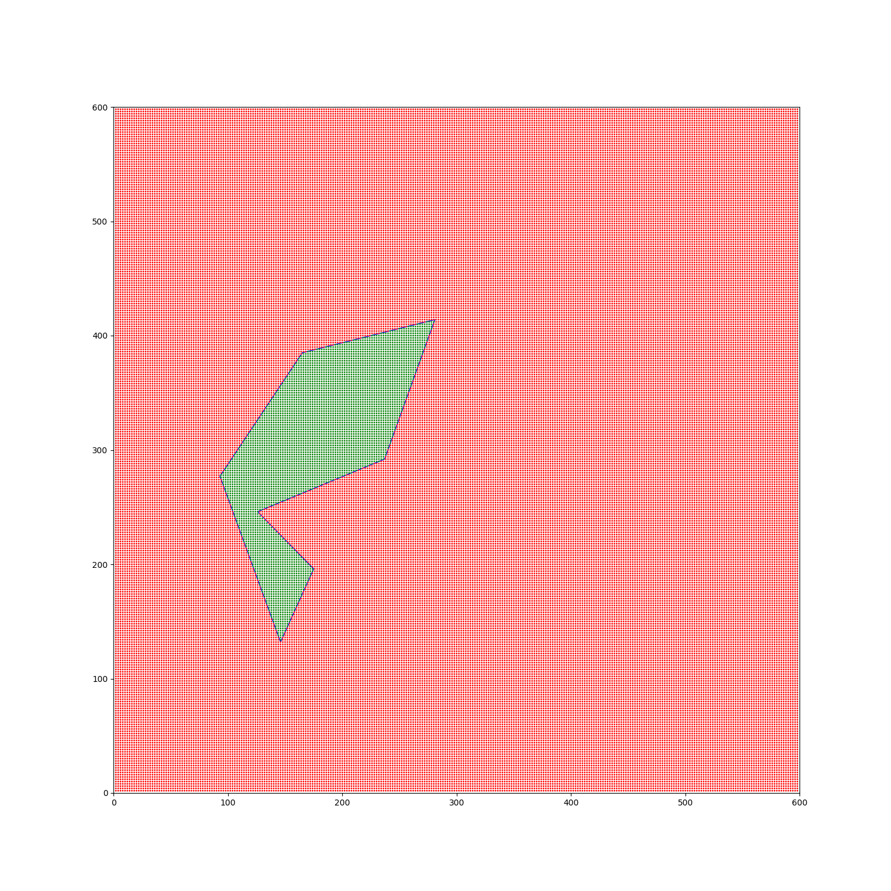

# Real-Time Python: Code in Python Run in Native

- [1. Tested Methods](#1-tested-methods)
- [2. Experiment Takeaways](#2-experiment-takeaways)
- [3. How to Reproduce](#3-how-to-reproduce)
  - [3.1. Installation](#31-installation)
  - [3.2. Codon Setup](#32-codon-setup)
  - [3.3. Rust Setup](#33-rust-setup)
  - [3.4. Running the App](#34-running-the-app)

This repository demonstrate some options to speedup your python code by leveraging native libraries.

The problem is, given several 2D polygons (in `polygons` directory) and thousands of points, determine whether each point is inside each of the polygons or not. The results should be visualized as a plot image.

Here is a sample of expected outputs:



The image might looks like it has green/red colors. But actually the green/red ones are the points that the app checks. They are so many so that they looks like solid colors. The ones colored in green are the points detected inside the polygon, and the ones colored in red are the points detected outside the polygon. The polygon is also drawn there, so you can check whether the algorithm works correctly or not.

## 1. Tested Methods

I tested several methods to implement the point-in-polygon algorithm. The implementations are contained in `libs` directory. Some approach requires writing algorithms manually. I am using winding number algorithm to determine whether a point is inside a polygon or not.

Here they are along with their measured latencies on my machine:

| Lib    | Method      | Description                                                              | Latency (s) | Remarks                                                                                      |
| ------ | ----------- | ------------------------------------------------------------------------ | ----------- | -------------------------------------------------------------------------------------------- |
| `lib1` | Pure Python | The base full-python implementation with for-loop and scalar operations. | 3.286       | Slowest                                                                                      |
| `lib2` | Numpy       | Vectorized Numpy implementation                                          | 0.064       | Faster but not optimal algorithm                                                             |
| `lib3` | Shapely     | Using high-level shapely modules                                         | 0.072       | No need to implement algorithms manually, easiest to use and similar performance with Numpy. |
| `lib4` | Numba-Numpy | The Numpy version but compiled using Numba JIT                           | 0.024       | Faster than Numpy without Numba                                                              |
| `lib5` | Numba       | The Pure Python version but compiled using Numba JIT                     | 0.006       | Significantly faster                                                                         |
| `lib6` | Codon-Numpy | The Numpy version but compiled using Codon                               | 0.040       | Faster than just Numpy, but Numba still faster                                               |
| `lib7` | Codon       | The Pure Python version but compiled using Codon                         | 0.066       | Faster than the Pure Python but Numba still faster                                           |
| `lib8` | Rust        | Re-implementation of the algorithm in Rust, then imported by Python      | 0.005       | As fast as Numba version, but with hassle of coding in different language                    |

As shown in the table, it is actually possible to speed-up Python algorithm (`lib1`) until 500x with just simple modification like Numba (`lib5`).

Additionally, I also did further improvements by optimizing the results PNG plot drawer. Here is my experiment result.

| Lib    | Method      | Description                                 | Latency (s) | Remarks                   |
| ------ | ----------- | ------------------------------------------- | ----------- | ------------------------- |
| `vis1` | Pure Python | Plot drawing with Matplotlib                | 9.576       | The default way in Python |
| `vis2` | Rust        | Plot drawing with Rust, using plotter crate | 0.069       | Faster                    |

Here we achieved 130x improvements!

## 2. Experiment Takeaways

- For simplest but quite fast implementation, use domain-specific off-the-shelf libaries. For example I used shapely for this case.
- If you want more speedups, implement the algorithms in pure Python and Numpy and compile it using Numba.
- If the case cannot be solved by just Python native and Numpy (like plotting), create small libraries using other language. In this example, I used Rust.

## 3. How to Reproduce

### 3.1. Installation

Run this for basic setup.

```sh
pip install -r requirements.txt 
```

### 3.2. Codon Setup

If you want to try codon, first you have to install it (follow the [instruction here](https://docs.exaloop.io/start/install/)). Be aware that you cannot install Codon in Windows, so you might need WSL. 

After Codon is installed, enter the library directory.

```sh
cd libs/lib6_codon_numpy
# or
cd libs/lib7_codon_python
```

Then do this to compile and produce the importable extension modules.

```sh
python3 setup.py build_ext --inplace
```

Now you are ready to use the Codon implementation.

### 3.3. Rust Setup

First, make sure Rust is installed in your system. You can follow their official instruction (like [this](https://rust-lang.org/tools/install/)).

Then enter the library directory.

```sh
cd libs/lib8_rust
# or
cd libs/vis2_rust
```

Run this to install the modules. This command install the library package into your Python environment.

```sh
maturin develop --release
```

You are ready to use Rust implementation now.

### 3.4. Running the App

You can run the demo by simply running `app.py`. For example

```sh
python app.py lib1 vis1
```

You can replace `lib1` with the algorithm implementation code name, and `vis1` with the plotter implementation code name.

Note that I have added profiling to the main algorithm implementation only, so latency data will be printed in the end. But you can run profiling of the full script (including the plotting) by running it using `pyinstrument`.

```sh
pyinstrument app.py lib1 vis1
```

To verify the results, you can check the visualizations in `outputs` directory.